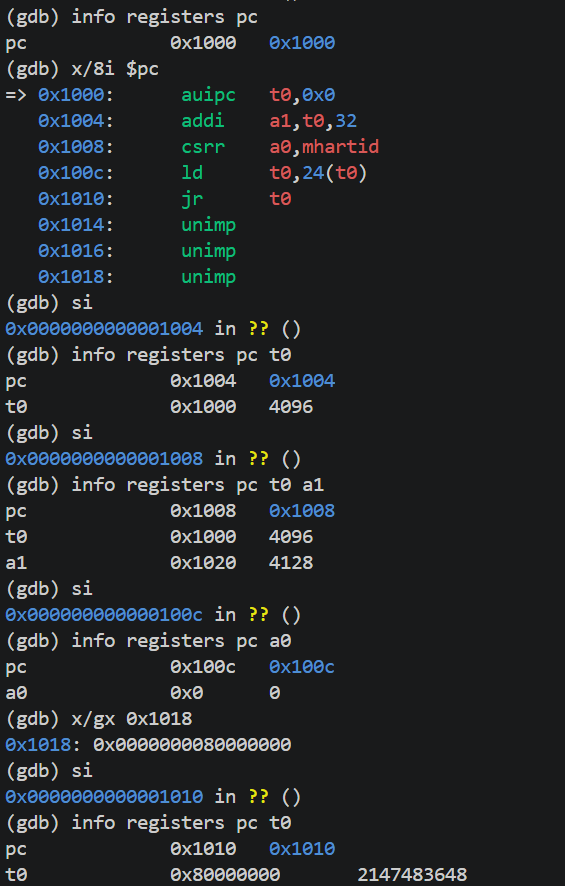
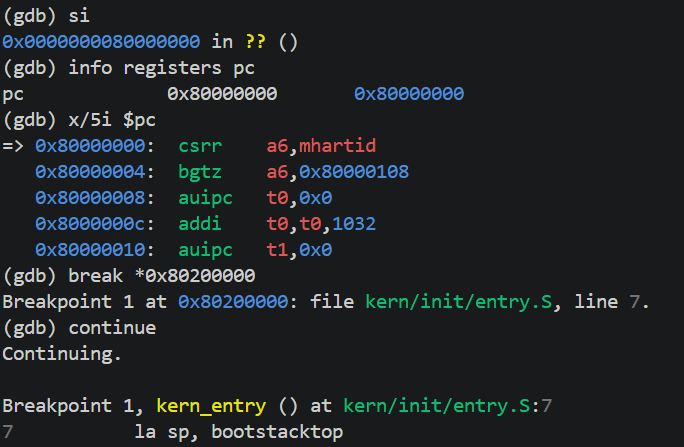
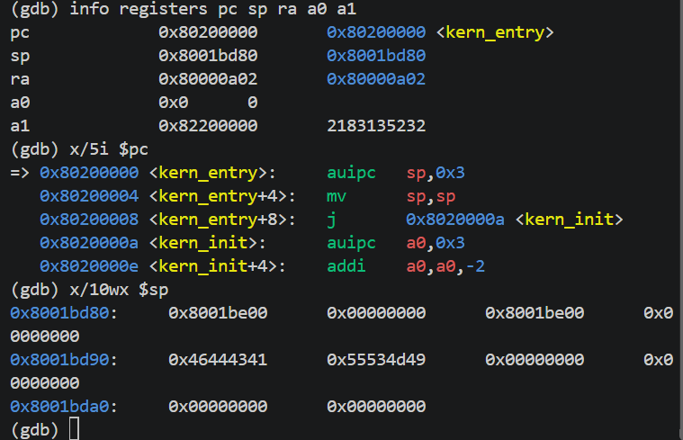

# Lab1：最小内核启动与调试实验报告

> **状态：成员一部分已完成源码分析与实际验证；练习二及其截图已补入，其他成员信息和截图待补。本文仍是小组报告草稿。**

## 实验基本信息

| 项目 | 内容 |
|---|---|
| 实验名称 | Lab1：最小内核启动与调试 |
| 小组成员 | 学号1-姓名1、2413276-胡楚骅、学号3-姓名3 |
| 成员一验证日期 | 2026-10-07 |
| 最终完成日期 | [小组完成后填写] |

### 小组分工

| 成员 | 实验分工 | 报告分工 |
|---|---|---|
| 学号1-姓名1 | 练习一、启动栈、入口指令与链接产物分析、入口后的单步核验 | 练习一、启动环境分析、相关理论与答辩准备 |
| 2413276-胡楚骅 | 练习二：从复位到内核入口的 GDB 跟踪 | 完整启动调试过程、关键指令与截图 |
| 学号3-姓名3 | 编译运行验证、提交检查与报告整合 | 实验环境、测试结果、提示词汇总和最终报告检查 |

## 一、实验目的

1. 理解最小内核的入口、启动栈及从汇编进入 C 代码的过程。
2. 将源码、链接后的内存布局和实际机器指令联系起来。
3. 使用 QEMU 与 GDB 观察执行过程，并用真实记录验证分析。
4. 理解实验中的启动与初始化机制及其与操作系统原理的联系。

## 二、实验环境

| 项目 | 本次成员一验证记录 |
|---|---|
| 环境 | Windows 下 Ubuntu WSL2，x86_64 |
| WSL 内核 | 6.18.40.1-microsoft-standard-WSL2 |
| 交叉编译器 | riscv64-unknown-elf-gcc，SiFive GCC 8.3.0-2020.04.1 |
| 模拟器 | QEMU 4.1.1，RISC-V virt |
| 调试器 | gdb-multiarch 15.1 |
| 固件输出 | OpenSBI v0.4 |
| 核验构建命令 | make -j2 |

原始版本和构建记录见 [environment-build.txt](evidence/environment-build.txt)。本次执行 make 确认已有目标为最新；不将它描述为本轮全量重新编译。

### AI 工具记录

| 成员 | AI 编程工具 | 底层模型 | 备注 |
|---|---|---|---|
| 学号1-姓名1 | Codex | [本人按实际客户端填写] | 辅助阅读源码、反汇编分析、编写验证脚本和整理答辩材料 |
| 2413276-胡楚骅 | codex | GPT-6.1 sol | 辅助指令编写，内容阅读理解以及整理报告 |
| 学号3-姓名3 | [待填写] | [待填写] | [待填写] |

## 三、实验整体逻辑分析

### 3.1 本章节的逻辑主线

本实验围绕最小内核如何开始执行展开。QEMU 加载镜像，启动固件将控制权交给内核入口；入口汇编设置启动栈并进入 C 初始化函数；初始化函数处理 BSS、打印启动信息并进入循环。

成员二负责复位到入口的完整轨迹。成员一负责入口之后建立栈和执行 C 代码的过程，结合链接产物核验地址和指令行为。

### 3.2 执行步骤及其依赖

1. **安排链接布局并加载镜像：** 为代码和数据提供对应的内存位置。
2. **到达内核入口：** CPU 控制流实际进入 kern_entry。
3. **初始化启动栈：** 后续 C 函数的栈访问需要明确的可用栈空间。
4. **进入 kern_init：** 完成初始化与输出。
5. **停留在循环中：** 保持最小内核运行，供调试观察。

这是对已有实验代码执行顺序的分析，不代表本小组新增实现了这些功能。

## 四、实验内容与分析

### 练习一：入口汇编与启动栈

**负责人：** [成员一学号-姓名]

#### 两条入口指令的操作与目的

```asm
kern_entry:
    la sp, bootstacktop
    tail kern_init
```

**la sp, bootstacktop：** 将启动栈顶部的地址写入栈指针 sp。启动栈大小由 KSTACKPAGE × PGSIZE 得到，为 2 × 4096 = 8192 字节。栈向低地址增长，初始 sp 指向预留空间的高地址端，为 C 函数保存寄存器和使用栈帧提供基础。la 取得的是地址，没有读取该地址处的数据。

**tail kern_init：** 将控制权转移到内核初始化函数，不设置新的返回地址 ra。该函数被声明为 noreturn，实际完成初始化和打印后进入无限循环，不需要返回汇编入口。noreturn 是编译器属性，不会自动产生循环；不返回的实际行为来自 while(1)。

调用约定与伪指令依据：[RISC-V psABI](https://riscv-non-isa.github.io/riscv-elf-psabi-doc/)、[RISC-V 汇编手册](https://github.com/riscv-non-isa/riscv-asm-manual/blob/main/src/asm-manual.adoc)。

#### 当前构建的分析与验证

| 项目 | 实际结果 |
|---|---|
| bootstack | 0x80201000 |
| bootstacktop | 0x80203000 |
| 栈范围 | [0x80201000, 0x80203000)，共 8 KiB |
| la 执行后 | sp = 0x80203000，满足 16 字节栈对齐 |
| tail 执行后 | pc = kern_init = 0x8020000a，ra 保持 0x80000a02 |
| C 函数栈帧 | sp 减去 16，变为 0x80202ff0 |
| 栈中保存的 ra | 位于 sp+8，即 0x80202ff8 |
| 普通调用 memset | jal 将 ra 设置为 0x80200026 |
| BSS 边界 | edata = end = 0x80203008，因此清零长度为 0 |
| memset 零长度路径 | a2 = 0，直接跳到 ret，没有执行存储循环 |
| 终止循环 | pc 在连续两次单步后保持 0x8020003a |

这些数值对应当前源码和工具链，不能推广为所有内核的固定布局。

最终入口反汇编：

```asm
80200000: 00003117  auipc sp,0x3
80200004: 00010113  mv    sp,sp
80200008: a009      j     8020000a <kern_init>
```

auipc 计算 0x80200000 + (3 << 12)，得到栈顶 0x80203000；第二条是 addi sp,sp,0 的别名。目标文件中 tail 原先为两条机器指令，链接后通过松弛优化变成两字节的压缩跳转。这说明源码伪指令的行数不等于实际机器指令的条数。

kern_init 的清零代码保留了 BSS 初始化流程，但本次没有非空 BSS 区域。优化调试中 GDB 曾把源码参数 n 显示成最大无符号数；寄存器 a2 为零且实际指令直接返回，因此不能把该显示解释成巨大长度的内存写入。

#### 深入分析

完整的栈布局、重定位、tail/call 对照、链接与加载关系，以及优化调试问题见 [成员一分析](成员一分析.md)。

#### 实际提示词和工作过程

本部分实际任务提示词包括“先看看练习一该怎么做”“我做成员一吧，你先把要做的内容构思好，尽量深入一些，有价值一些”和“你开始做吧”。完整原文与任务范围调整记录保存在 [prompt.md](prompt.md)。

工作过程为：阅读源码与宏定义 → 检查符号表、ELF 节和目标文件重定位 → QEMU/GDB 单步验证 → 对优化变量显示差异补充控制流验证 → 整理报告与答辩材料。没有将已有的入口代码描述为本轮新实现，也没有虚构代码修复迭代。

### 练习二：从复位到内核入口的调试

**负责人：** 2413276-胡楚骅

#### 1. GDB 跟踪过程与观察

本次使用 QEMU 4.1.1。在两个 WSL 终端中分别运行 `make debug` 和 `make gdb`，使模拟 CPU 在执行第一条指令前暂停，并通过 GDB 连接。

**复位入口。** 使用 `info registers pc` 和 `x/8i $pc`，观察到初始 PC 为 `0x1000`。逐条执行 `si` 后，`t0` 被设置为 `0x1000`；随后计算 `0x1000 + 32 = 0x1020`，将设备树地址放入 `a1`；再读取当前硬件线程编号，得到 `a0 = 0`。这说明引导代码先取得地址基准，再准备传给固件的启动参数。

随后，`ld t0,24(t0)` 访问的地址为 `0x1000 + 24 = 0x1018`。使用 `x/gx 0x1018`，观察到该位置存放 `0x80000000`；执行这条加载指令后，`t0` 的值与之相同。此时 PC 为 `0x1010`，下一条指令将使用 `t0` 中的地址进行跳转。



**进入 OpenSBI 并交接给内核。** 执行 `jr t0` 后，PC 变为 `0x80000000`，确认进入 OpenSBI。接着使用 `break *0x80200000` 设置内核入口断点，再执行 `continue`，让 CPU 连续运行，直到命中 `kern_entry`。程序停在 `la sp, bootstacktop` 执行之前，验证了控制流已从固件到达内核入口。本次没有逐条跟踪 OpenSBI 内部的初始化过程。



**入口状态探索。** 此时 PC 为 `0x80200000`，`sp` 为 `0x8001bd80`。由于设置内核栈的 `la sp, bootstacktop` 尚未执行，`sp` 仍是固件留下的值，不能据此判断内核栈已初始化。此时 `a0` 仍为 `0`，而 `a1` 已从复位阶段的 `0x1020` 变为 `0x82200000`，说明固件交接给内核时的参数状态发生了变化；其具体变化过程未在本次单步跟踪中展开。

使用 `x/10wx $sp` 查看栈附近十个 32 位内存单元，观察到既有非零内容，也有零值。这些是固件执行后留下的实际状态，不能仅凭数值将其判断为随机垃圾。本次跟踪到内核第一条指令执行前为止。



#### 2. 思考与回答

**RISC-V 硬件加电后最初执行的几条指令位于什么地址？**

在本实验 QEMU 4.1.1 的 `virt` 机器配置中，CPU 从复位地址 `0x1000` 开始执行，最初五条有效引导指令位于 `0x1000` 至 `0x1010`。它们属于 QEMU 提供的复位引导代码，尚不是 uCore 内核代码。

**它们主要完成哪些功能？**

| 地址 | 指令 | 功能 |
|---|---|---|
| `0x1000` | `auipc t0,0` | 将当前指令地址 `0x1000` 放入 `t0`，作为后续地址计算的基准。 |
| `0x1004` | `addi a1,t0,32` | 计算设备树地址 `0x1020`，通过 `a1` 传给固件。设备树描述机器的硬件配置。 |
| `0x1008` | `csrr a0,mhartid` | 读取当前硬件线程编号，通过 `a0` 传给固件；本次为 `0`。 |
| `0x100c` | `ld t0,24(t0)` | 从 `0x1018` 读取八字节的固件入口地址，得到 `0x80000000`。 |
| `0x1010` | `jr t0` | 跳转到 `0x80000000`，将控制权交给 OpenSBI。 |

这些指令主要准备启动参数并转交控制权，后续初始化由 OpenSBI 继续完成。反汇编中的后续 `unimp` 是填充或地址数据被按指令解码的结果，不属于这五条顺序执行的引导指令。

本次实际验证的启动路径为：`0x1000` 复位入口 → `0x80000000` OpenSBI → `0x80200000` uCore 内核入口。

## 五、测试与验证

### 5.1 成员一完成的验证

运行仓库中的验证脚本：

```bash
bash report/evidence/verify-exercise1.sh
```

脚本核验构建与工具版本，检查 ELF，并启动本实验 QEMU，通过 GDB 对入口栈、尾调用、C 栈帧、零长度 memset 和终止循环进行单步断言。本次全部检查通过，日志末尾记录：

```text
ALL EXERCISE 1 CHECKS PASSED
```

这只表示上述练习一检查通过，不代表完整操作系统测试通过。

原始记录：[GDB 日志](evidence/gdb-entry.txt)、[ELF 分析](evidence/elf-analysis.txt)、[QEMU 输出](evidence/qemu-output.txt)。QEMU 已打印预期的启动字符串，末尾 signal 15 为验证脚本主动结束该进程。

### 5.2 截图

成员二的三张实际调试截图已插入练习二正文。成员一、成员三的截图待补；成员一截图清单与具体操作见 [证据与截图说明](evidence/README.md)。

### 5.3 验收脚本的限制

原压缩包未提供 tools/grade.sh，Makefile 中虽然有 grade 目标，当前不能据此完成有效验收。未把缺失的验收脚本描述成测试通过。

## 六、实验总结与收获

### 6.1 成员一：与操作系统原理的联系

| 实验知识 | 理论联系 | 本实验的范围 |
|---|---|---|
| 启动栈及栈帧 | 执行上下文、调用约定与内存布局 | 单一启动栈，尚未实现进程栈切换 |
| 链接布局与镜像加载 | 程序装载与地址布局 | 固定布局，没有通用 ELF 加载器 |
| BSS 初始化 | 静态存储对象初始化与运行环境 | 当前构建为空范围 |
| 固件交接与内核入口 | 系统引导及软件层次 | 完整复位轨迹由练习二验证 |

进程调度、完整异常处理、分页管理、用户态程序运行、文件系统等重要 OS 知识尚未在当前最小内核中实现。

### 6.2 AI 协作经验

成员一通过源码、实际反汇编和寄存器状态交叉核对 AI 给出的解释。例如，通用解释中“初始化 BSS”需要结合当前 edata/end 才能确定实际清零长度；优化变量的异常显示需要进一步检查真实指令路径。成员二、成员三的具体经验待本人补充。

## 七、完成前待办

- [ ] 填写三位成员姓名、学号及实际 AI 工具和模型。
- [x] 成员二完成练习二、关键指令解释和截图。
- [ ] 补齐成员一与成员三的实际截图，并插入正确引用。
- [ ] 汇总所有成员真实提示词、验证记录和个人经验。
- [ ] 三位成员共同核对报告并练习完整启动过程的口头讲解。
- [ ] 确认 lab1 分支的 code/、report/report.md、report/prompt.md、report/images/。

