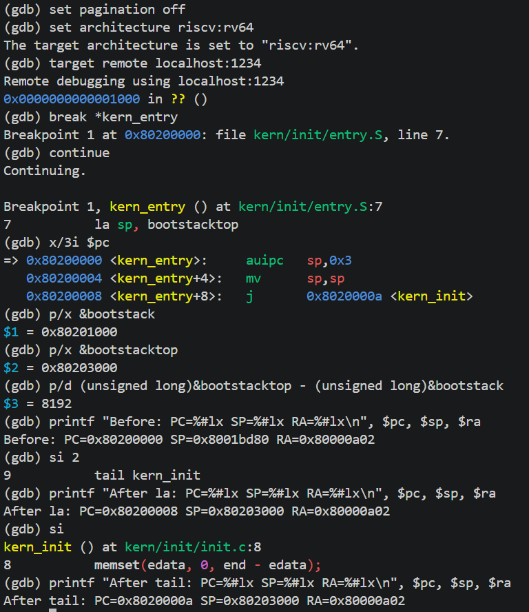
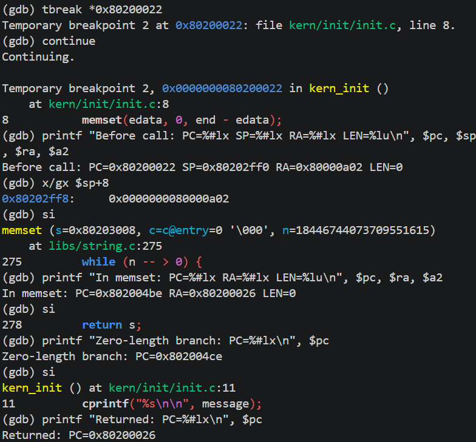
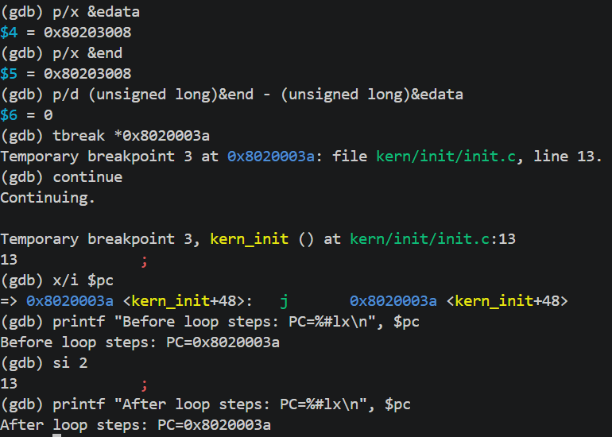
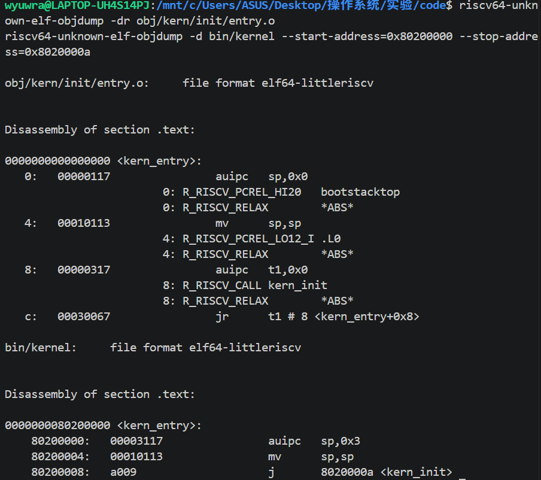

# Lab1：最小内核启动与调试实验报告

## 实验基本信息

| 项目 | 内容 |
|---|---|
| 实验名称 | Lab1：最小内核启动与调试 |
| 小组成员 | 2412832-王雅枫、2413276-胡楚骅、2412737-罗元伟 |
| 成员一验证日期 | 2026-10-06 |
| 成员二验证日期 | 2026-10-07 |
| 成员三验证日期 | 2026-10-08 |
| 完成日期 | 2026-10-08 |

### 小组分工

| 成员 | 实验分工 | 报告分工 |
|---|---|---|
| 2412832-王雅枫 | 练习一、启动栈、入口指令与链接产物分析、入口后的单步核验 | 练习一、启动环境分析、相关理论与答辩准备 |
| 2413276-胡楚骅 | 练习二：从复位到内核入口的 GDB 跟踪 | 完整启动调试过程、关键指令与截图 |
| 2412737-罗元伟 | 启动流程与功能模块关系分析、实验结果整理 | 整体逻辑、核心模块说明、课程原理对照、提示词记录与报告整合 |

## 一、实验目的

1. 理解机器复位、OpenSBI 初始化和内核入口之间的控制权交接，回答内核如何开始执行。
2. 理解链接布局、启动栈和 BSS 初始化怎样共同建立最小 C 运行环境。
3. 理解内核格式化输出如何经控制台封装和 SBI 服务到达设备。
4. 使用 QEMU 与 GDB 将源码、机器指令、寄存器和内存状态对应起来，完成两道练习。
5. 对照课程中的进程、资源管理与特权保护知识，说明本实验已经涉及和尚未实现的机制。

## 二、实验环境

| 项目 | 实验环境 |
|---|---|
| 环境 | Windows 下 Ubuntu WSL2，x86_64 |
| WSL 内核 | 6.18.40.1-microsoft-standard-WSL2 |
| 交叉编译器 | riscv64-unknown-elf-gcc，SiFive GCC 8.3.0-2020.04.1 |
| 模拟器 | QEMU 4.1.1，RISC-V virt |
| 调试器 | gdb-multiarch 15.1 |
| 固件输出 | OpenSBI v0.4 |
| 核验构建命令 | make -j2 |

### AI 工具记录

| 成员 | AI 编程工具 | 底层模型 | 备注 |
|---|---|---|---|
| 2412832-王雅枫 | Codex | GPT-6.1 sol,GPT-Astra | 辅助阅读源码、反汇编分析、编写验证脚本和整理答辩材料 |
| 2413276-胡楚骅 | Codex, Codex cli | GPT-6.1 sol | 辅助指令编写、内容理解及练习二报告整理 |
| 2412737-罗元伟 | Codex, ClaudeCode | GPT-6.1 sol, claude-opus-5-5 | 辅助整体逻辑梳理、OS 原理对照与报告整理 |

## 三、实验整体逻辑分析

### 2.1 本章节的逻辑主线

我们将本章的核心问题理解为：在还没有普通应用运行环境的机器上，如何让内核取得控制权、执行 C 函数并输出第一条信息。Lab0 提供工具环境，Lab1 则把构建、引导、初始化和输出连接成一个最小可运行内核。当前框架已给出主要代码，本组工作以理解和调试验证为主。

这条主线包含两个相互配合的过程。**构建过程**将 C 与汇编交叉编译成目标文件，依据 `kernel.ld` 完成链接，得到供调试使用的 ELF 文件 `bin/kernel`，再由 `objcopy` 生成供加载使用的裸镜像 `bin/ucore.img`。**执行过程**由 QEMU 预先将镜像放入指定内存，CPU 从复位入口开始，经 OpenSBI 到达 `kern_entry`，建立启动栈，进入 `kern_init`，执行初始化与打印，最后停留在无限循环中。

因此，镜像存在于内存、CPU 跳到内核入口、内核具备 C 函数运行条件是三个需要分别验证的环节。链接地址、QEMU 加载地址和固件交接目标应相互配合。当前配置采用 `0x80200000`，其正确性由符号表、反汇编以及练习二入口断点共同支持。Makefile 的 loader 参数没有设置 `cpu-num`，加载镜像这一步本身不会把 CPU 的 PC 改成内核入口。

练习一从内核入口向后解释“为什么能够执行 C 代码”，练习二从机器复位向前追踪“为什么会到达内核入口”。将两部分接起来即启动字符串背后的完整依赖关系。

### 2.2 功能的逐步实现

1. **明确固件与内核的启动约定。** 本实验 QEMU `virt` 的复位入口是 `0x1000`，复位代码准备参数并进入 `0x80000000` 的 OpenSBI，固件再向内核交接。确定前一阶段提供什么、下一阶段从哪里开始后再安排内核镜像。

2. **安排代码、数据和启动栈的位置。** 链接脚本将入口和各节放在约定的地址，汇编文件预留固定启动栈。这个阶段回答“内存中的哪些字节属于内核”，并保证后续取指、取地址和栈访问具有一致的地址依据。

3. **建立最小 C 运行条件。** `kern_entry` 设置 `sp` 后转入 `kern_init`，后者用链接器边界符号确定 BSS 初始化范围。函数调用可能保存返回地址和使用局部栈空间，因此应先有正确的栈；静态存储对象则需要满足零初始化语义。本次构建的 BSS 范围为空，但通用初始化步骤仍保留。

4. **提供可观察的输出。** 从底层 SBI 字符输出开始，向上封装 `cons_putc`、字符回调和格式化输出。`kern_init` 得以用 `cprintf` 表达要打印的内容。分层让上层逻辑集中于文本格式，并把具体固件调用约定放在底层。

5. **将上述模块构建成镜像并启动。** 交叉编译器为 RISC-V 生成指令，链接器确定地址，QEMU 模拟目标机器并加载镜像。到这一步，前面的源码和布局约定成为真实的执行对象。出现启动输出说明执行到达了打印路径。

6. **按关键边界进行调试核验。** 练习二通过复位单步和内核入口断点检查控制流，练习一通过入口后的单步检查栈、尾跳转、C 栈帧和初始化。打印结果与中间机器状态共同构成证据，避免仅凭源码解释就断言执行过程正确。

上述内容是理解功能依赖与开展验证的顺序。实际运行时先完成构建，再由复位流程执行内核。

## 四、实验内容与实现

### 练习一：入口汇编与启动栈

**负责人：** 2412832-王雅枫

#### 两条入口指令的操作与目的

```asm
kern_entry:
    la sp, bootstacktop
    tail kern_init
```

**la sp, bootstacktop：** 将启动栈顶部的地址写入栈指针 sp。启动栈大小由 KSTACKPAGE × PGSIZE 得到，为 2 × 4096 = 8192 字节。栈向低地址增长，初始 sp 指向预留空间的高地址端，为 C 函数保存寄存器和使用栈帧提供基础。la 取得的是地址，没有读取该地址处的数据。

**tail kern_init：** 将控制权转移到内核初始化函数，不设置新的返回地址 ra。该函数被声明为 noreturn，实际完成初始化和打印后进入无限循环，不需要返回汇编入口。noreturn 是编译器属性，不会自动产生循环；不返回的实际行为来自 while(1)。

调用约定与伪指令依据：[RISC-V psABI](https://riscv-non-isa.github.io/riscv-elf-psabi-doc/)、[RISC-V 汇编手册](https://github.com/riscv-non-isa/riscv-asm-manual/blob/main/src/asm-manual.adoc)。

#### 当前构建的分析与验证

| 项目 | 实际结果 |
|---|---|
| bootstack | 0x80201000 |
| bootstacktop | 0x80203000 |
| 栈范围 | [0x80201000, 0x80203000)，共 8 KiB |
| la 执行后 | sp = 0x80203000，满足 16 字节栈对齐 |
| tail 执行后 | pc = kern_init = 0x8020000a，ra 保持 0x80000a02 |
| C 函数栈帧 | sp 减去 16，变为 0x80202ff0 |
| 栈中保存的 ra | 位于 sp+8，即 0x80202ff8 |
| 普通调用 memset | jal 将 ra 设置为 0x80200026 |
| BSS 边界 | edata = end = 0x80203008，因此清零长度为 0 |
| memset 零长度路径 | a2 = 0，直接跳到 ret，没有执行存储循环 |
| 终止循环 | pc 在连续两次单步后保持 0x8020003a |

这些数值对应当前源码和工具链，不能推广为所有内核的固定布局。

最终入口反汇编：

```asm
80200000: 00003117  auipc sp,0x3
80200004: 00010113  mv    sp,sp
80200008: a009      j     8020000a <kern_init>
```

auipc 计算 0x80200000 + (3 << 12)，得到栈顶 0x80203000；第二条是 addi sp,sp,0 的别名。目标文件中 tail 原先为两条机器指令，链接后通过松弛优化变成两字节的压缩跳转。这说明源码伪指令的行数不等于实际机器指令的条数。

kern_init 的清零代码保留了 BSS 初始化流程，但本次没有非空 BSS 区域。优化调试中 GDB 曾把源码参数 n 显示成最大无符号数；寄存器 a2 为零且实际指令直接返回，因此不能把该显示解释成巨大长度的内存写入。

#### 实际调试截图与结果

**启动栈与尾调用。** 在内核入口设置断点，先查看入口机器指令和栈边界，再分别执行 la 对应的两条机器指令及 tail 跳转。截图显示栈大小为 8192 字节；sp 从固件留下的 0x8001bd80 变为 0x80203000；tail 执行后 pc 为 0x8020000a，ra 仍为 0x80000a02，验证了栈初始化及尾调用不设置新返回地址的行为。



**C 栈帧与普通调用。** 在调用 memset 前停下，观察到 sp = 0x80202ff0，sp+8 处保存了 0x80000a02。单步执行普通调用后 ra 变为 0x80200026。传参寄存器 a2 为零，随后 pc 直接到达返回指令 0x802004ce，再返回 0x80200026，说明本次零长度调用没有进入存储循环。截图中的源码变量 n 显示为最大无符号值，需结合寄存器和真实控制流分析，不能将该显示当作实际写入长度。



**BSS 范围与终止循环。** 查看 edata、end 得到相同地址 0x80203008，差值为零。运行到 kern_init 的循环位置，当前指令跳回自身，连续执行两条机器指令后 pc 仍为 0x8020003a，验证了无限循环的实际行为。



**重定位与链接优化。** 对照 entry.o 与最终 bin/kernel 的入口反汇编，目标文件中可见地址相关重定位和 tail 对应的 auipc/jr 序列；最终内核中 tail 被优化成编码为 a009 的两字节跳转。la 则对应 auipc 与 addi 的组合，后者因低位立即数为零而显示为 mv sp,sp。



#### 深入分析

完整的栈布局、重定位、tail/call 对照、链接与加载关系，以及优化调试问题见 [成员一分析](成员一分析.md)。

#### 核心函数与功能模块的理解

**1. 链接布局：明确各部分的地址与边界。** [kernel.ld](../code/tools/kernel.ld) 指定目标架构、ELF 入口和 `BASE_ADDRESS`，依次组织 `.text`、`.rodata`、`.data`、`.sdata` 和 `.bss`。其中 `.text` 保存指令，`.rodata` 保存常量，有初值的可写对象放在数据节，零初始化对象的范围由 BSS 相关边界体现。`edata` 和 `end` 是链接器符号，在 C 代码中通过外部声明引用。我们理解这个模块承担的是静态地址安排；运行时的物理页分配和进程地址空间管理仍需其他模块完成。

`ENTRY(kern_entry)` 写入 ELF 入口信息，代码节的排列决定入口在镜像中的实际位置。裸镜像的 loader 不通过 ELF 入口字段选择执行地址，因此需要结合最终符号表验证入口与加载位置一致。链接脚本中的 `ALIGN(0x1000)` 是 4096 字节对齐，汇编中的 `.align PGSHIFT` 在本目标上对应 `2^12` 字节对齐；这些地址安排尚未建立页表。

**2. 汇编入口：使用预留栈并交给 C 初始化。** [entry.S](../code/kern/init/entry.S) 在 `.data` 中通过 `.space KSTACKSIZE` 预留 8 KiB 空间，`bootstack` 和 `bootstacktop` 分别标记两端。`la` 只把栈顶地址写入 `sp`，空间已在构建时预留。随后 `tail` 转移控制流，保留原有 `ra`。该跳转仍属于内核内部的控制流，M 模式向 S 模式的交接由固件启动过程负责。活动栈位于 `edata` 之前，避免被随后的 BSS 初始化范围覆盖。

**3. C 初始化：准备静态数据、打印并保持运行。** [init.c](../code/kern/init/init.c) 的核心函数为：

```c
int kern_init(void) __attribute__((noreturn));
```

它先调用 `memset(edata, 0, end - edata)`，再用 `cprintf` 输出启动文本，最后进入忙循环。[string.c](../code/libs/string.c) 中实际使用的接口是 `void *memset(void *s, char c, size_t n)`，本调用的三个参数分别是起始地址、零值和范围长度。这里的 C 函数依赖入口建立的栈与链接器给出的边界。调试时 `end - edata` 为零，`memset` 直接进入返回路径，因此本次调用没有向 BSS 区域写入数据。

`noreturn` 是对编译器的函数行为说明，无限循环是源码实际实现的终点。CPU 仍在执行循环中的指令，尚未进入等待中断状态，也没有选择其他任务运行。

**4. 格式化输出：将格式串转换为字符序列。** [stdio.c](../code/kern/libs/stdio.c) 的 `cprintf(const char *fmt, ...)` 建立可变参数列表，再交给 `vcprintf(const char *fmt, va_list ap)`。后者初始化字符计数，调用 [printfmt.c](../code/libs/printfmt.c) 中的 `vprintfmt`，通过 `cputch` 回调输出字符并更新计数。对应接口为：

```c
int cprintf(const char *fmt, ...);
int vcprintf(const char *fmt, va_list ap);
void vprintfmt(void (*putch)(int, void *), void *putdat,
              const char *fmt, va_list ap);
```

本次打印使用 `%s`，`vprintfmt` 从参数列表取出字符串并逐字符交给回调。我们理解这里把“解释格式”与“送出字符”分开，格式化代码可以复用，底层输出路径可以独立封装。头文件和实现均来自实验项目，构建使用 `-nostdinc`、`-nostdlib` 等配置，不依赖宿主系统的标准输出运行环境。

**5. 控制台与 SBI：请求固件完成字符输出。** [console.c](../code/kern/driver/console.c) 的 `cons_putc(int c)` 将字符转为 `unsigned char` 并调用 [sbi.c](../code/libs/sbi.c) 的 `sbi_console_putchar(unsigned char ch)`，后者调用：

```c
uint64_t sbi_call(uint64_t sbi_type, uint64_t arg0,
                  uint64_t arg1, uint64_t arg2);
```

`sbi_call` 把本代码使用的旧式 SBI 服务号放在 `a7`，参数放在 `a0` 至 `a2`，执行 `ecall`，再从 `a0` 取得返回值。字符输出服务号为 1，字符经 `a0` 传递。其调用关系为 `kern_init → cprintf → vcprintf → vprintfmt → cputch → cons_putc → sbi_console_putchar → sbi_call → OpenSBI`。

我们理解这一层体现了受控的服务请求：S 模式内核请求 M 模式固件服务，固件完成输出后返回。`cons_init`、`kbd_intr` 和 `serial_intr` 在当前源码中都是空函数，打印能力来自已有固件服务，本实验没有自行实现完整的中断式控制台驱动。源码与课程[从 SBI 到 stdio](http://8.135.34.58/lab2026/_book/lab1/lab1_3_3_sbi_io.html)对应。

#### 最终提示词与分析过程

我们先让 AI 解释入口汇编及其与启动流程的关系，再要求深入分析栈布局、伪指令和链接产物，最后执行单步验证。实施分析与验证的最终提示词为：

```text
你开始做吧
```

前续提示词为“先看看练习一该怎么做”和“我做成员一吧，你先把要做的内容构思好，尽量深入一些，有价值一些”。截图阶段使用“我拉取下来了，现在看我练习一该怎么截图了”和“截好图了，下一步呢”继续整理结果，完整记录见 [prompt.md](prompt.md)。

分析按源码、目标文件重定位、最终 ELF 和 GDB 单步结果的顺序推进。源码说明操作意图，目标文件说明地址如何由链接器确定，最终反汇编给出 CPU 实际执行的指令，单步结果则验证寄存器和控制流的变化。

调试中遇到两个问题。其一，GDB 把优化后的源码变量 `n` 显示为最大无符号数。我们检查传参寄存器 `a2`，再单步观察分支，确认实际长度为零，执行直接绕过存储循环。其二，一次粘贴多行 GDB 命令时出现 `"on" or "off" expected`，后续命令没有执行；改为逐条输入并确认输出后完成截图。改进后的验证方式同时检查寄存器、真实指令和执行路径，使解释与运行结果一致。

### 练习二：从复位到内核入口的调试

**负责人：** 2413276-胡楚骅

#### 1. GDB 跟踪过程与观察

本次使用 QEMU 4.1.1。在两个 WSL 终端中分别运行 `make debug` 和 `make gdb`，使模拟 CPU 在执行第一条指令前暂停，并通过 GDB 连接。

**复位入口。** 使用 `info registers pc` 和 `x/8i $pc`，观察到初始 PC 为 `0x1000`。逐条执行 `si` 后，`t0` 被设置为 `0x1000`；随后计算 `0x1000 + 32 = 0x1020`，将设备树地址放入 `a1`；再读取当前硬件线程编号，得到 `a0 = 0`。这说明引导代码先取得地址基准，再准备传给固件的启动参数。

随后，`ld t0,24(t0)` 访问的地址为 `0x1000 + 24 = 0x1018`。使用 `x/gx 0x1018`，观察到该位置存放 `0x80000000`；执行这条加载指令后，`t0` 的值与之相同。此时 PC 为 `0x1010`，下一条指令将使用 `t0` 中的地址进行跳转。


**进入 OpenSBI 并交接给内核。** 执行 `jr t0` 后，PC 变为 `0x80000000`，确认进入 OpenSBI。接着使用 `break *0x80200000` 设置内核入口断点，再执行 `continue`，让 CPU 连续运行，直到命中 `kern_entry`。程序停在 `la sp, bootstacktop` 执行之前，验证了控制流已从固件到达内核入口。本次没有逐条跟踪 OpenSBI 内部的初始化过程。


**入口状态探索。** 此时 PC 为 `0x80200000`，`sp` 为 `0x8001bd80`。由于设置内核栈的 `la sp, bootstacktop` 尚未执行，`sp` 仍是固件留下的值，不能据此判断内核栈已初始化。此时 `a0` 仍为 `0`，而 `a1` 已从复位阶段的 `0x1020` 变为 `0x82200000`，说明固件交接给内核时的参数状态发生了变化；其具体变化过程未在本次单步跟踪中展开。

使用 `x/10wx $sp` 查看栈附近十个 32 位内存单元，观察到既有非零内容，也有零值。这些是固件执行后留下的实际状态，不能仅凭数值将其判断为随机垃圾。本次跟踪到内核第一条指令执行前为止。


#### 2. 思考与回答

**RISC-V 硬件加电后最初执行的几条指令位于什么地址？**

在本实验 QEMU 4.1.1 的 `virt` 机器配置中，CPU 从复位地址 `0x1000` 开始执行，最初五条有效引导指令位于 `0x1000` 至 `0x1010`。它们属于 QEMU 提供的复位引导代码，尚不是 uCore 内核代码。

**它们主要完成哪些功能？**

| 地址 | 指令 | 功能 |
|---|---|---|
| `0x1000` | `auipc t0,0` | 将当前指令地址 `0x1000` 放入 `t0`，作为后续地址计算的基准。 |
| `0x1004` | `addi a1,t0,32` | 计算设备树地址 `0x1020`，通过 `a1` 传给固件。设备树描述机器的硬件配置。 |
| `0x1008` | `csrr a0,mhartid` | 读取当前硬件线程编号，通过 `a0` 传给固件；本次为 `0`。 |
| `0x100c` | `ld t0,24(t0)` | 从 `0x1018` 读取八字节的固件入口地址，得到 `0x80000000`。 |
| `0x1010` | `jr t0` | 跳转到 `0x80000000`，将控制权交给 OpenSBI。 |

这些指令主要准备启动参数并转交控制权，后续初始化由 OpenSBI 继续完成。反汇编中的后续 `unimp` 是填充或地址数据被按指令解码的结果，不属于这五条顺序执行的引导指令。

本次实际验证的启动路径为：`0x1000` 复位入口 → `0x80000000` OpenSBI → `0x80200000` uCore 内核入口。

#### 3. 构建、模拟器与调试模块的理解

[Makefile](../code/Makefile) 将构建与调试工具连接起来：交叉编译生成 RISC-V 目标文件，链接脚本生成含符号的 `bin/kernel`，`objcopy -O binary` 再产生裸镜像 `bin/ucore.img`。QEMU 加载裸镜像，GDB 读取 ELF 的符号与调试信息，使机器地址能够关联到 `kern_entry`、`kern_init` 和源码行。

`make debug` 使用 `-S` 在执行第一条指令前暂停 CPU，使用 `-s` 开启默认 1234 端口的 GDB 服务。`make gdb` 读取 `bin/kernel`、设置 RISC-V 64 位架构并连接调试端口。`si` 检查一条机器指令的效果，`info registers` 查看寄存器，`x` 查看指令或内存，入口断点则让固件运行到下一关键边界。这些操作回答的是“执行到哪里、机器状态如何变化”。

指导书建议观察 `0x80200000` 的写入；当前 Makefile 使用 QEMU loader 预加载镜像，GDB 接入时该区域可能已经有内核字节。数据观察点只监视设置之后的写入，因此本组用内核执行断点核验控制权交接，并未记录加载写入时刻。内存中已有指令和 CPU 正在执行这些指令需要分别判断。

#### 4. 调试策略与问题处理

复位引导代码只有少量指令，适合逐条执行并观察参数寄存器；OpenSBI 的初始化过程较长，因此使用内核入口断点继续运行到交接边界。到达入口后，结合 `pc`、`sp` 与反汇编判断内核栈是否已经建立。这种方法既保留关键步骤的观察结果，也避免在固件中进行大量重复单步。

入口处的 `sp = 0x8001bd80` 是固件留下的栈指针。此时 `la sp, bootstacktop` 尚未执行，所以应继续观察栈初始化指令，而不能将这个值当作内核启动栈地址。镜像内容已经位于内存时，则用执行断点判断内核是否获得控制权。AI 协作使用的提示词记录见 [prompt.md](prompt.md)。

## 五、测试与验证

### 5.1 编译与运行

在 WSL 的代码目录执行 `make -j2`，构建记录显示：

```text
make: Nothing to be done for 'TARGETS'.
```

这表示构建目标已经是最新状态。QEMU 启动后先输出 OpenSBI 的平台与固件信息，随后打印内核启动字符串：

```text
(THU.CST) os is loading ...
```

启动输出说明 CPU 已到达 `kern_init` 的打印路径，格式化输出、控制台封装和 SBI 字符服务能够配合工作。构建环境见 [environment-build.txt](evidence/environment-build.txt)，启动输出见 [qemu-output.txt](evidence/qemu-output.txt)。日志末尾的 signal 15 来自验证脚本结束 QEMU。

### 5.2 GDB 单步与脚本验证

从仓库根目录运行入口验证脚本：

```bash
bash report/evidence/verify-exercise1.sh
```

脚本检查 ELF 布局，通过 QEMU 和 GDB 验证栈地址与对齐、尾跳转的返回地址、C 栈帧、普通调用、零长度 `memset` 和终止循环。断言通过后，日志输出：

```text
ALL EXERCISE 1 CHECKS PASSED
```

具体结果见 [GDB 日志](evidence/gdb-entry.txt)和 [ELF 分析](evidence/elf-analysis.txt)。练习二则通过复位单步和入口断点，验证了 `0x1000 → 0x80000000 → 0x80200000` 的启动路径。两部分分别解释进入内核前的控制权交接和进入内核后的 C 运行环境。

### 5.3 调试截图

练习一的四张截图展示启动栈与尾调用、C 栈帧与零长度 `memset`、BSS 与终止循环、重定位与链接优化；练习二的三张截图展示复位指令、固件到内核入口的跳转和入口寄存器状态。七张截图均放在对应练习的分析之后。图片与文本证据的对应关系见 [证据说明](evidence/README.md)。

## 六、实验总结与收获

### 对操作系统的理解

#### 6.1 本实验中的重要知识点及其与 OS 原理的关系

**1. 分阶段引导与控制权交接。** 系统引导要让机器从有限的复位状态进入内核能够接管资源的状态。本实验观察到复位代码准备参数、OpenSBI 执行固件初始化、CPU 到达 `kern_entry`，体现了各阶段按约定交接。它与 OS 原理中启动、初始化和软件层次的含义相联系；本实验采用模拟器预加载镜像，尚不包含完整的磁盘引导链和运行中的资源管理。进入内核入口只是建立后续 OS 服务的起点。

**2. BSS 初始化与运行环境准备。** 零初始化的静态存储对象需要在程序运行时具有正确初值。`kern_init` 使用链接边界调用 `memset`，体现内核自行准备这部分环境的职责；普通应用常由装载器和运行时协助完成。该步骤与内存布局及程序装载有关，但只解决初值问题，没有提供动态内存分配或访问保护。本次构建中边界相等，实际清零长度为零，这是通用初始化意图与本次实际执行效果之间应保留的区别。

**3. 特权保护与受控服务请求。** 系统调用和特权级提供了受控访问资源的基础。Lab1 的 `sbi_call` 经 `ecall` 请求固件输出，体现低一层特权软件通过接口请求更高特权服务的思想。本实验的调用双方是 S 模式内核与 M 模式固件；课程中应用向内核请求 `write` 的双方则是用户程序与内核。它们具有相似的分层关系，接口及服务对象不同。`tail kern_init` 是普通控制流跳转，特权级转换不能由这条跳转解释；SBI 请求使用异常机制，也不表示 uCore 自身的完整异常处理框架已实现。

**4. I/O 抽象与模块分工。** 操作系统通过统一接口屏蔽硬件细节。`cprintf` 只处理格式化需求，字符回调连接格式化模块与控制台，SBI 封装处理固件接口，说明上层与底层可以按职责组合。这与 OS 的设备抽象和代码复用相关。本实验只借用固件完成字符输出，尚未处理完整设备驱动、I/O 请求队列、异步完成和多个任务共享设备的问题。

#### 6.2 OS 原理中重要而本实验尚无对应实现的知识点

本实验建立了最小内核的启动与输出能力，尚未实现完整操作系统的资源管理功能。结合课程中的相关知识，我们认为以下内容同样重要。

**1. 进程抽象、PCB 与生命周期管理。** 进程是程序的运行实体，内核通过 PCB 维护其运行状态与资源信息。完整 OS 应记录任务标识、状态、执行上下文和资源关系，并管理创建、退出等过程。Lab1 仅有一个启动内核，没有进程对象、PCB 管理链表或进程创建退出功能。

**2. 上下文切换、CPU 调度与分时复用。** 分时系统需要让多个任务轮流使用 CPU，并保存和恢复各任务的执行状态。调度决定谁使用 CPU，上下文切换实现任务之间的执行状态交接。Lab1 中 `sp` 的建立和 C 函数对 `ra` 的保存为理解这些内容提供基础，但没有就绪任务选择、时间片、抢占或 `switch_to`。末尾忙循环持续占用当前执行流，没有调度其他任务。

**3. 进程状态、阻塞唤醒与事件驱动。** 就绪、运行和阻塞状态反映任务是否具备运行条件，内核通过就绪队列和等待队列组织这些任务。OS 需要在任务等待事件时让出 CPU，在事件发生后使任务重新可运行。本实验没有等待队列、任务状态机或阻塞唤醒机制。GDB 的暂停、QEMU 的退出及 SBI 输出完成均不能替代这一组 OS 功能。

**4. 用户态执行、系统调用接口与隔离。** 用户程序通过标准库和系统调用请求内核服务，特权保护限制其对内核资源的直接访问。完整 OS 要能够执行用户程序，检查请求与用户地址，并限制程序对内核和其他任务资源的访问。Lab1 尚无用户态程序、系统调用分派或进程间隔离；现有 SBI 调用的服务关系是内核请求固件，不能代作用户态系统调用实现。

#### 6.3 参考资料

- 操作系统课程讲义：引言、进程与上下文切换。
- [riscv64-ucore Lab1 启动流程](http://8.135.34.58/lab2026/_book/lab1/lab1_3_booting.html)和[实验练习](http://8.135.34.58/lab2026/_book/lab1/lab1_2_1_exercise.html)。
- [RISC-V psABI](https://riscv-non-isa.github.io/riscv-elf-psabi-doc/)与 [RISC-V 汇编手册](https://github.com/riscv-non-isa/riscv-asm-manual/blob/main/src/asm-manual.adoc)。

### AI 协作开发的经验

总体来说，AI帮助我们快速完成环境准备，分工和流程梳理。

具体而言，AI 帮助我们快速梳理了启动流程、伪指令和模块之间的关系，但理解最终仍要落实到具体指令与运行状态。练习一中，`la` 对应两条机器指令，`tail` 又经过链接优化变为压缩跳转；只有结合目标文件、最终反汇编和单步结果，才能准确解释一次 `si` 执行了什么。

遇到 GDB 将 `memset` 的变量 `n` 显示为最大无符号数时，我们没有仅凭源码层面的显示判断程序行为，而是进一步检查 `a2` 和分支路径，确认实际传入零长度并直接返回。这让我们认识到，优化编译下应同时考虑源码、调用约定和机器指令。

调试命令也需要按步骤执行。多行粘贴出现参数错误后，逐条输入并检查输出更容易定位问题。分工时，我们将复位到入口、入口后的初始化分别分析，再用统一的地址、工具版本和观察结果连接两道练习。这样既提高了协作效率，也使每位成员能够理解整体启动过程。
